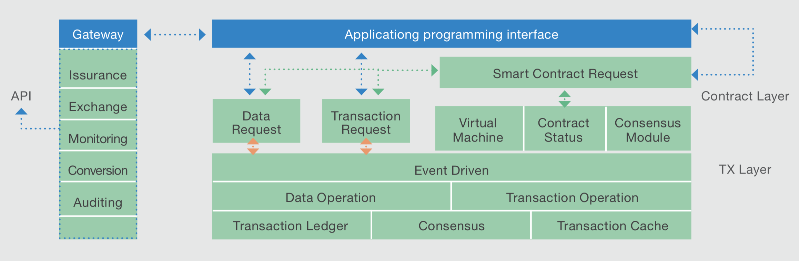

# Bessel Chain

## Bessel Chain is a next generation, quantum-resistant distributed ledger technology utilizing POW (Proof-Of-Work) and pBFT (Practical Byzantine Fault Tolerance) consensus algorithm

Bessel Chain is a peer-to-peer decentralized network system that built upon a distributed Internet protocol. It enables secure, instant and nearly free financial transactions of tokens across the Internet. The tokens can represent currency, commodity or any other unit of value such as frequent flier miles or gift coupons. It provides real-time assets settlement solution that is the mirror of real world.

Bessel Chain has three basic elements: account, assets and transaction. Everyone can have accounts and hold resources, with this condition people can make assets transaction, and Bessel Chain ensures all transaction effect. From assets transaction, Bessel Chain concludes payment, book offer, assets finder, assets convert, and relation settlement transaction. With these transaction types, people can make assets flow freely.

## Architecture ##
The born of Bessel Chain is to solve the problem of current blockchain technology. Comparing to Bitcoin, Bessel Chain integrates smart contract originally and comparing to Ethereum, the underlying blockchain adopts a more reasonable multi-layer method, which separates the execution of the smart contract from the transactions; this would avoid the problem of contracts affecting the whole system and allowing more flexible implementation of smart contracts.

## Start ##

How to compile see doc/compile.md

